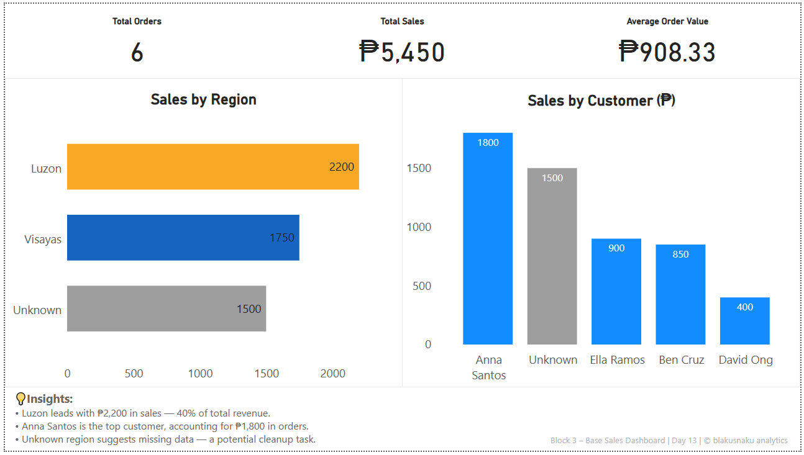

# 🧩 SQL → Python → Power BI Journey
**by [blakusnaku](https://github.com/blakusnaku)**

A hands-on daily learning series connecting **data querying**, **data transformation**, and **data visualization** — from raw SQL to clean dashboards.

---

## 📚 Overview
Each folder represents one day of practice, following a 4-block structure:
| Block | Focus | Tools Used |
|-------|--------|------------|
| 1 | Data extraction & joins | SQL (SQLite) |
| 2 | Data transformation | Python (pandas) |
| 3 | Visualization | Power BI |
| 4 | Reflection | Markdown (Insights + Learnings) |

---

## 🧱 Folder Structure
```
day13_sql_to_powerbi_sales_dashboard/
├── data/
│   ├── customers.csv
│   ├── orders.csv
│   └── orders_customers_joined_pandas.csv
├── scripts/
│   ├── block1_join_orders_customers.sql
│   ├── block2_pandas_join.py
├── dashboard/
│   └── block3_powerbi_base_dashboard.pbix
├── notes/
│   └── block4_learning_log.md
└── assets/
    └── day13_dashboard.png
```
## 🧠 Sample Day (Day 13 – Base Sales Dashboard)


**Highlights:**
- SQL joins for `orders` + `customers`
- Pandas merge validation
- KPI cards for Total Orders, Total Sales, Average Order Value
- Insights integrated directly into the Power BI layout

---

## 🔗 Future Goals
- Automate daily dataset imports using Python scripts  
- Add Power BI interactivity (slicers, filters)  
- Create a cumulative “Weekly Summary Dashboard” 

---

💬 *“Turning daily drills into data storytelling.”*  
