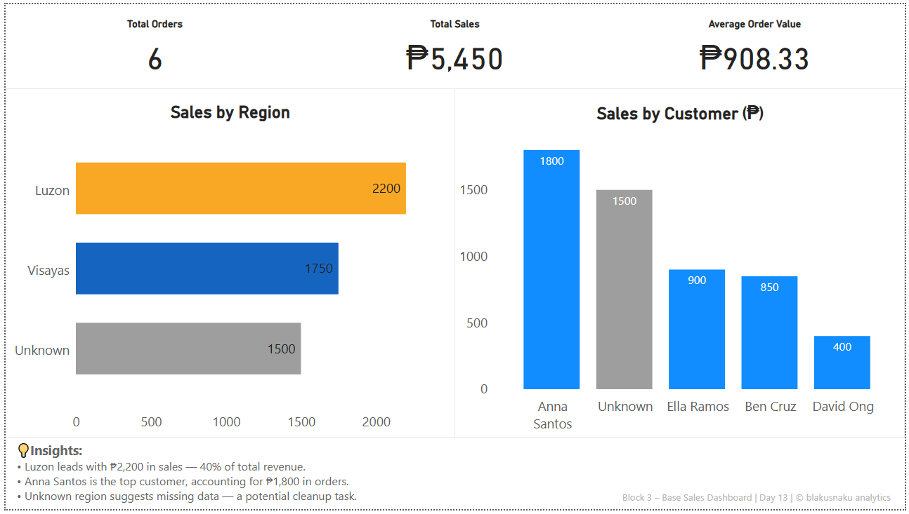

# Day 13 – SQL → Power BI: Base Sales Dashboard

**Focus:** Joining Orders and Customers data using SQL & pandas, and visualizing insights with KPI cards in Power BI.  
**Tools:** SQLite • Python (pandas) • Power BI  
**Key Outputs:**  
- SQL joins (`INNER JOIN`) between Orders and Customers  
- Data validation with `pandas.merge()`  
- KPI cards for Total Orders, Sales, and Avg Order Value  
- Sales by Region and Top Customers visualization
  

📘 [Read full learning log →](notes/block4_learning_log.md)
