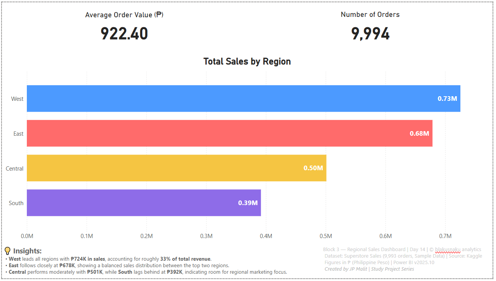

# 🌍 Day 14 — Regional Sales Dashboard

**Date:** October 12, 2025  
**Phase:** Pipeline Flow  
**Tools:** SQL • Python (pandas) • Power BI  
**Dataset:** Superstore Sales (Sample — 9,993 Orders)  
**Author:** [JP Malit (blakusnaku)](https://github.com/blakusnaku)

---

## 🧩 Overview
This project focuses on building a **Regional Sales Dashboard** using Power BI to visualize performance across geographic regions.  
The dataset was prepared in Python (cleaned CSV) and visualized to highlight sales distribution, profitability, and regional performance trends.  
The goal was to connect data preprocessing skills with storytelling through visuals — translating clean data into business insight.

---

## ⚙️ Pipeline Flow

| Block | Tool | Focus | Output |
|:------|:-----|:------|:--------|
| **Block 1** | SQL | Extract regional sales data from `orders` table and perform grouping by region | Aggregated results |
| **Block 2** | Python (pandas) | Clean, standardize numeric and regional values; export clean version for BI use | `superstore_cleaned.csv` |
| **Block 3** | Power BI | Build regional sales dashboard with KPIs, visual comparisons, and footer branding | `Block3_Regional_Sales.pbix` |

---

## 🧠 Key Learnings
- Understood how **data consistency** directly affects visualization accuracy.  
- Practiced creating **regional aggregations** for sales and profit comparisons.  
- Learned how to maintain design continuity — consistent titles, spacing, and footer placement across dashboards.  
- Developed a structured visual hierarchy (Title → KPIs → Chart → Footer).  
- Recognized how KPI placement and color psychology impact readability and viewer focus.

---

## 💬 Reflections
This project marked a stronger integration between data preparation and visual storytelling.  
It solidified the concept that every chart should **answer a question**, not just display data.  
I also realized how valuable layout discipline is — using structured proportions and consistent formatting builds professional, portfolio-worthy dashboards.  
Each day feels like a step closer to mastering the data pipeline flow and presentation synergy.

---

## 📊 Dashboard / Deliverables Preview
**Title:** *Regional Sales Dashboard (Day 14)*  
**Visuals:**  

- 4 KPI cards: Total Sales • Total Profit • Total Orders • Avg Order Value  
- Sales by Region column chart  
- Profit by Region bar chart  
- Footer with insights and standardized format  
**Figures in ₱ (Philippine Peso)**  

---

## ⛓️ Study Dashboard Hub
This project journey builds into my **central Study Dashboard**, which you can explore here:  
[blakusnaku-study-dashboard GitHub](https://github.com/blakusnaku/blakusnaku-study-dashboard)

---

## 🧾 Footer Info
**Block 3 — Regional Sales Dashboard | Day 14 | © blakusnaku analytics**  
Dataset: *Superstore Sales (9,993 orders, Sample Data)* | Source: *Kaggle*  
Figures in ₱ (Philippine Peso) | Power BI v2025.10  
Created by *JP Malit | Study Project Series*

---

## 🗂️ File Structure
```
day14_regional_analysis/
│
├── data/
│ ├── superstore.csv
│ ├── superstore_noheader.csv
│ ├── superstore.db
│ └── regions_summary.csv
│
├── scripts/
│ ├── block1_aggregate_sales_region.sql
│ └── block2_pandas_groupby_region.py
│
├── dashboard/
│ └── block3_regional_totals.pbix
│
├── notes/
│ └── block4_learning_log.md
│
├── assets/
│ └── day14_regional_analysis_dashboard.png
│
└── README.md
```
---

## #Tags
`#SQL` `#Python` `#PowerBI` `#RegionalSales` `#DataVisualization` `#AnalyticsPipeline` `#StudyProjectSeries`

---

**End of Day 14 — Regional Analysis Dashboard**
