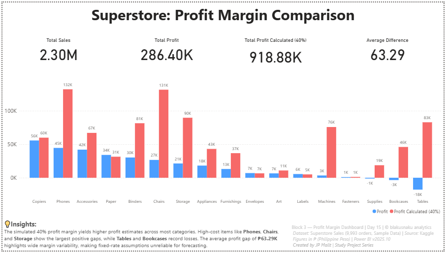

# 💰 Day 15 — Profit Margin Analysis

**Date:** October 13, 2025  
**Phase:** Pipeline Flow  
**Tools:** SQL • Python (pandas) • Power BI  
**Dataset:** Superstore Sales (Sample — 9,993 Orders)  
**Author:** [JP Malit (blakusnaku)](https://github.com/blakusnaku)

---

## 🧩 Overview
This project explores **profit margin simulation and comparison** using the Superstore dataset.  
The workflow covers the full **data pipeline** — from SQL calculation to Python cleaning to Power BI visualization — simulating a 40% profit assumption and comparing it against actual recorded profits.
 
---

## ⚙️ Pipeline Flow

| Block | Tool | Focus | Output |
|:------|:-----|:------|:--------|
| **Block 1** | SQL | Create calculated column `profit_calc = sales * 0.4` and compare with actual `profit` using temporary `diff` | Query results table |
| **Block 2** | Python (pandas) | Clean numeric fields, replicate calculations, validate data, export CSV for BI use | `superstore_with_profit.csv` |
| **Block 3** | Power BI | Build interactive Profit Margin Dashboard with KPIs, profit comparison chart, and footer insights | `Block3_Profit_Dashboard.pbix` |

---

## 🧠 Key Learnings
- Realized that **temporary computed columns** (`AS diff`) are more efficient than permanently altering tables.  
- Understood how `pd.to_numeric(errors="coerce")` safely handles malformed rows and how `isna().sum()` provides a quick data quality check.  
- Reinforced how pandas mirrors SQL logic (`SELECT`, `ALTER`, `UPDATE`, `AS`) in Pythonic syntax.  
- Designed a Power BI dashboard with a **10–20–55–15** layout (Title → KPI → Chart → Footer) for balanced composition.  
- Strengthened overall understanding of **data pipeline continuity**: *query → clean → visualize*.  

---

## 💬 Reflections
This session reinforced that learning is most powerful when it’s **guided by discovery** rather than memorization.  
The aha moment from the temporary `diff` column showed how analytical thinking evolves naturally through curiosity.  
By keeping a consistent workflow and design identity (`© blakusnaku analytics | Study Project Series`), each dashboard feels part of a connected learning journey — both technical and personal.  

---

## 📊 Dashboard Preview
**Title:** *Profit Margin Dashboard (Day 15)*  
**Visuals:**  

- 4 KPI cards: Total Sales • Actual Profit • Simulated Profit (40%) • Average Difference  
- Clustered column chart: Actual vs Simulated Profit by Category  
- Insight section and standardized footer  
**Figures in ₱ (Philippine Peso)**

---

## ⛓️ Study Dashboard Hub

This project journey builds into my **central Study Dashboard**, which you can explore here:  
[blakusnaku-study-dashboard GitHub](https://github.com/blakusnaku/blakusnaku-study-dashboard)

---

## 🧾 Footer Info
**Block 3 — Profit Margin Dashboard | Day 15 | © blakusnaku analytics**  
Dataset: *Superstore Sales (9,993 orders, Sample Data)* | Source: *Kaggle*  
Figures in ₱ (Philippine Peso) | Power BI v2025.10  
Created by *JP Malit | Study Project Series*

---

### 🗂️ File Structure
```

day15_profit/
│
├── data/
│ ├── superstore.csv
│ ├── superstore_noheader.csv
│ ├── superstore_with_profit.csv
│ └── superstore.db
│
├── scripts/
│ ├── block1_sql_query.sql
│ └── block2_python_action.py
│
├── dashboard/
│ └── Block3_Profit_Dashboard.pbix
│
├── notes/
│ └── block4_learning_log.md
│
└── README.md

```
---

### #Tags
`#SQL` `#Python` `#PowerBI` `#DataCleaning` `#ProfitMargin` `#AnalyticsPipeline` `#StudyProjectSeries`  

---


**End of Day 15 — Profit Margin Analysis**
