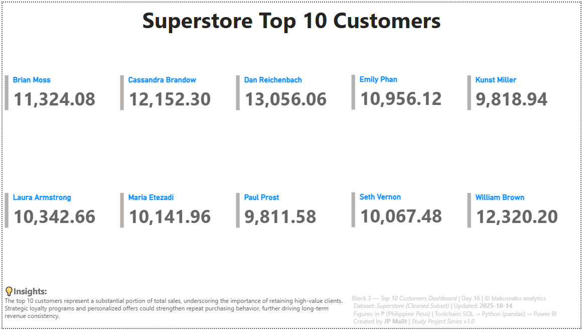

# 🧾 Day 16 — Top 10 Customers Dashboard

**Date:** October 14, 2025  
**Phase:** Pipeline Flow  
**Tools:** SQL • Python (pandas) • Power BI  
**Dataset:** Superstore Sales (Cleaned Subset)  
**Author:** [JP Malit (blakusnaku)](https://github.com/blakusnaku)

---

## 🧩 Overview
This project focuses on identifying and visualizing the **Top 10 Customers by Total Sales** from the Superstore dataset.  
The workflow demonstrates a full **SQL → Python → Power BI** data pipeline — from filtering the top customers in SQL, validating with pandas, and presenting the final 2×5 card layout dashboard in Power BI.  
This exercise highlights the balance between *data accuracy* and *visual composition awareness* within limited layout flexibility.

---

## ⚙️ Pipeline Flow

| Block | Tool | Focus | Output |
|:------|:-----|:------|:--------|
| **Block 1** | SQL | Aggregate total sales by `customer_id` and `customer_name`, sort descending, and export top 10 | `top10_customers.csv` |
| **Block 2** | Python (pandas) | Load and verify dataset, ensure formatting and rounding consistency | `top10_customers_verified.csv` |
| **Block 3** | Power BI | Visualize top 10 customers in a 2×5 card grid, apply standardized footer and branding | `top10_customer_cards.pbix` |

---

## 🧠 Key Learnings
- Reinforced the use of **SQL aggregation (`GROUP BY`, `SUM`, `ORDER BY`)** for ranking and filtering data.  
- Understood the role of **temporary exports (`.output`)** and header management in SQLite.  
- Strengthened cross-tool data consistency — ensuring column integrity between SQL, Python, and Power BI.  
- Learned how Power BI’s **Multi-row Card** visual behaves with automatic vertical stacking and limited spacing control.  
- Developed stronger visual literacy by balancing the **functional clarity** of data with **aesthetic alignment** in layout.

---

## 💬 Reflections
This session marked a turning point in dashboard awareness — transitioning from functional output to design consciousness.  
Although Power BI’s layout constraints limited precision, the experience deepened appreciation for composition and proportion.  
I realized that dissatisfaction with the visuals is actually *a sign of refinement* — it shows sensitivity to structure, rhythm, and balance.  
Future sessions will explore hybrid design workflows (Power BI → Canva/Figma) for pixel-level precision while retaining analytical depth.

---

## 📊 Dashboard Preview
**Title:** *Top 10 Customers Dashboard (Day 16)*  
**Visuals:**  

- 2×5 card grid showing customer names and total sales  
- Standardized footer with insights, dataset info, and author credit  
- Title → KPI grid → Footer flow (15% | 70% | 15%)  

**Figures in ₱ (Philippine Peso)**  

---

## ⛓️ Study Dashboard Hub
This project contributes to the ongoing **Study Dashboard Series**, documenting progress across multiple data analytics disciplines.  
View the full learning dashboard here:  
[blakusnaku-study-dashboard GitHub](https://github.com/blakusnaku/blakusnaku-study-dashboard)

---

## 🧾 Footer Info
**Block 3 — Top 10 Customers Dashboard | Day 16 | © blakusnaku analytics**  
Dataset: *Superstore Sales (Cleaned Subset)* | Source: *Kaggle*  
Figures in ₱ (Philippine Peso) | Toolchain: SQL → Python (pandas) → Power BI  
Created by *JP Malit | Study Project Series v1.0*

---

### 🗂️ File Structure
```
day16_top10_customers/
│
├── data/
│ ├── superstore.csv
│ ├── superstore.db
│ ├── top10_customers.csv
│ └── top10_customers_verified.csv
│
├── scripts/
│ ├── block1_sql_top10_customers.sql
│ └── block2_python_top10_customers.py
│
├── dashboard/
│ └── top10_customer_cards.pbix
│
├── notes/
│ └── block4_learning_log.md
│
├── assets/
│ └── top10_customer_cards.png
│
└── README.md

```

### #Tags
`#SQL` `#Python` `#PowerBI` `#DataVisualization` `#AnalyticsPipeline` `#CustomerInsights` `#StudyProjectSeries`

---

**End of Day 16 — Top 10 Customers Dashboard**
