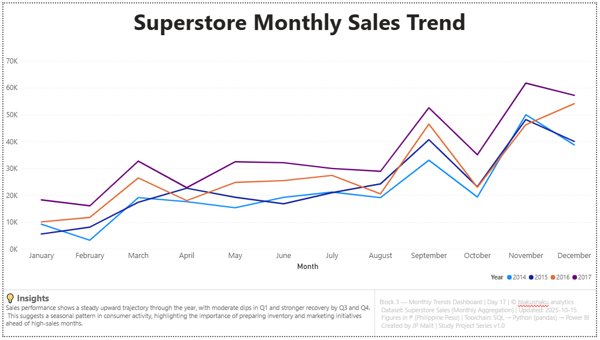

# 📈 Day 17 — Monthly Trends Analysis  

**Date:** October 15, 2025  
**Phase:** Pipeline Flow  
**Tools:** SQL • Python (pandas) • Power BI  
**Dataset:** Superstore Sales (Monthly Aggregation)  
**Author:** [JP Malit (blakusnaku)](https://github.com/blakusnaku)  

---

## 🧩 Overview  
This project explores **monthly sales performance** within the Superstore dataset, building a clear time-series visualization to identify seasonal trends.  
The workflow connects all three key tools — **SQL → Python (pandas) → Power BI** — to demonstrate a complete, modular data pipeline for temporal analysis.

---

## ⚙️ Pipeline Flow  

| Block | Tool | Focus | Output |
|:------|:-----|:------|:--------|
| **Block 1** | SQL | Aggregate monthly totals for sales, profit, and order counts using `STRFTIME('%Y-%m', order_date)` | `monthly_totals_raw.csv` |
| **Block 2** | Python (pandas) | Convert `month` to datetime, add `month_name` and `year` columns for readability | `monthly_totals_clean.csv` |
| **Block 3** | Power BI | Create a multi-year line chart showing monthly sales trends with standardized layout | `monthly_trend_visual.pbix` |

---

## 🧠 Key Learnings  
- Realized that **CSV header rows** can be mistakenly imported as data, causing `NULL` groupings in SQL — deleting the rogue header fixed the issue.  
- Reinforced how `STRFTIME()` depends on properly formatted ISO dates (`YYYY-MM-DD`) for grouping accuracy.  
- Practiced **datetime manipulation** in pandas and learned how `.dt.strftime('%b')` and `.dt.year` simplify downstream visualization.  
- Solved Power BI’s **dot-line issue** by setting the X-axis as *continuous* and confirming that `month` was a true date field.  
- Strengthened dashboard uniformity by applying the **standard 15 | 70 | 15 layout** with footer (108 px height, #F9FAFB background, #DADADA divider).  

---

## 💬 Reflections  
This day solidified the complete pipeline workflow — **SQL cleaning → pandas enrichment → Power BI visualization**.  
Encountering the phantom header row emphasized how small import mistakes can ripple through an analysis pipeline, while Power BI visualization taught precision in handling time-based data.  
Design-wise, today marked the full adoption of your **standardized Power BI footer**, creating a visually consistent identity for all dashboards moving forward.

---

## 🧭 Dashboard Preview  


**💡 Insights:**  
Sales performance shows a steady upward trajectory through the year, with moderate dips in Q1 and stronger recovery by Q3 and Q4.  
This suggests a seasonal pattern in consumer activity, highlighting the importance of preparing inventory and marketing initiatives ahead of high-sales months.  

**Metadata:**  
Block 3 — Monthly Trends Dashboard | Day 17 | © blakusnaku analytics  
Dataset: Superstore Sales (Monthly Aggregation) | Updated: 2025-10-15  
Figures in ₱ (Philippine Peso) | Toolchain: SQL → Python (pandas) → Power BI  
Created by JP Malit | Study Project Series v1.0  

---

## 🧭 Study Dashboard Hub  
📊 [View the Study Dashboard (Google Sheets)](https://docs.google.com/spreadsheets/d/1TLP4skR9L8p8keZBImYdIXdy1Gyl0mBcUqyHPyfwIXE/edit?usp=sharing)

---

## 🗂️ File Structure  

```
day17_monthly_trends/
├── assets/
│   └── monthly_trend_chart.png
│
├── data/
│   ├── monthly_totals_raw.csv
│   └── monthly_totals_clean.csv
│
├── scripts/
│   ├── block1_sql_monthly_totals.sql
│   └── block2_python_add_month_column.py
│
├── notes/
│   └── block4_learning_log.md
│
├── dashboard/
│   └── monthly_trend_visual.pbix
│
└── README.md
```
### #Tags

#SQL #Python #Pandas #PowerBI #DataVisualization #TimeSeries #MonthlyTrends #Superstore #Blakusnaku100Days

**End of Day 17 — Monthly Trends Analysis**

