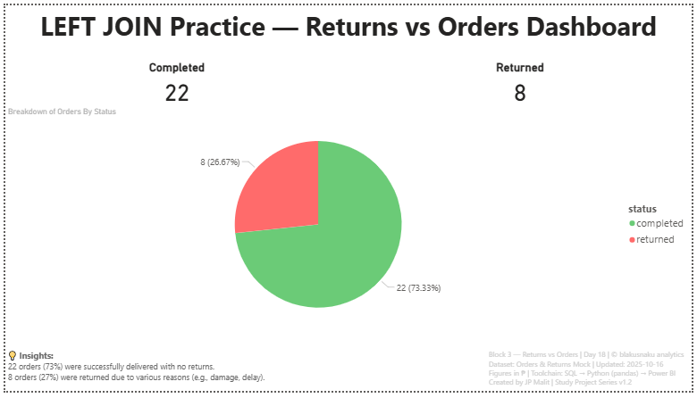

# 📊 Day 18 — LEFT JOIN Practice: Returns vs Orders Dashboard

**Date:** October 16, 2025  
**Phase:** Pipeline Flow  
**Tools:** SQL • Python (pandas) • Power BI  
**Dataset:** Mock Orders & Returns Data (30 Orders, 8 Returns)  
**Author:** [JP Malit (blakusnaku)](https://github.com/blakusnaku)

---

## 🧩 Overview
This project explores the use of **LEFT JOIN** across the full data analytics pipeline — from SQL query logic to Python replication and Power BI visualization.  
The focus was to simulate how orders and returns data interact, identify completed vs returned transactions, and visualize delivery performance metrics in a clean dashboard layout.

---

## ⚙️ Pipeline Flow

| Block | Tool | Focus | Output |
|:------|:-----|:------|:--------|
| **Block 1** | SQL | Practice `LEFT JOIN` between `orders` and `returns` | Joined dataset showing both matched (returned) and unmatched (completed) records |
| **Block 2** | Python (pandas) | Replicate join logic using `.merge(how="left")` | DataFrame with new `status` column (`Returned` / `Completed`) |
| **Block 3** | Power BI | Visualize completed vs returned orders | Donut chart + KPI cards with footer insights and metadata |

---

## 🧠 Key Learnings
- Practiced `LEFT JOIN` logic to **retain all primary records** (orders) while appending related return details.  
- Used `WHERE r.order_id IS NULL` in SQL to isolate **non-returned orders** (later reframed as “Completed”).  
- Replicated join behavior in Python with:

```
  merged = pd.merge(orders, returns, how='left', on='order_id')
```
Built independent KPI cards in Power BI using visual-level filters.

Reframed the narrative from “Not Returned” → “Completed” to highlight fulfillment success.

Maintained consistent styling under the Study Dashboard v1.2 standard layout.

---

## 📊 Dashboard Preview

Insights Summary:

22 orders (73%) were successfully completed with no returns.
8 orders (27%) were returned due to various issues (e.g., damage, delay).

---

## ⛓️ Study Dashboard Hub
This project contributes to the ongoing **Study Dashboard Series**, documenting progress across multiple data analytics disciplines.  
View the full learning dashboard here:  
[blakusnaku-study-dashboard GitHub](https://github.com/blakusnaku/blakusnaku-study-dashboard)
 
---

## 🗂 File Structure
```
day18_left_join/
├── assets/
│   └── day18_left_join_dashboard.png
│
├── dashboard/
│   └── day18_left_join_dashboard.pbix
│
├── data/
│   ├── orders.csv
│   ├── returns.csv
│   ├── orders_returned_left_join.csv
│   └── practice.db
│
├── scripts/
│   ├── block1_sql_action.sql
│   └── block2_python_action.py
│
├── notes/
│   └── block4_learning_log.md
│
└── README.md
```
---

## #Tags 

#SQL #Python #Pandas #PowerBI #LEFTJOIN #DataPipeline #100DaysOfData #BlakusnakuAnalytics

---

**End of Day 18 — Left Join**
