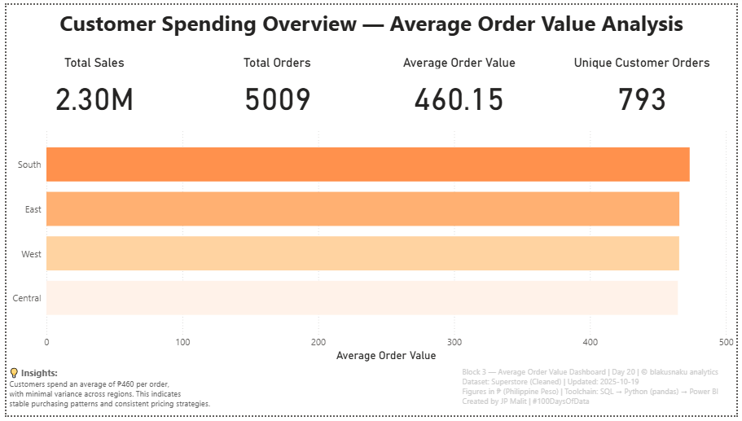

# 💳 Day 20 — Average Order Value Dashboard (₱)

**Date:** October 19, 2025  
**Phase:** Integration & Dashboard Design  
**Tools:** SQL • Python (pandas) • Power BI  
**Dataset:** Superstore (Cleaned)  
**Author:** [JP Malit (blakusnaku)](https://github.com/blakusnaku)

---

## 🧭 Overview  
The **Average Order Value (AOV) Dashboard** measures the average spending per customer order and visualizes how it varies across regions.  
This project combines SQL calculations, Python validation, and Power BI visualization — showcasing an integrated data pipeline from raw data to insight-driven analytics.  

It also introduces the official **blakusnaku Orange color identity**, now standardized for all future dashboards.

---

## ⚙️ Pipeline Flow

| Block | Tool | Focus | Output |
|:------|:-----|:------|:--------|
| **Block 1** | SQL | Calculated total sales, unique orders, and derived AOV | Verified ₱458.61 as the true average order value |
| **Block 2** | Python | Cross-checked results via pandas and exported clean dataset | Confirmed data integrity and exported `aov_per_customer.csv` |
| **Block 3** | Power BI | Built KPI cards and AOV by Region visualization | Designed final dashboard with 4 KPIs + bar chart |
| **Block 4** | GitHub | Documentation, reflection, and visual identity setup | Published README + learning log |

---

## 📊 Dashboard Preview  

**📍 Customer Spending Overview — Average Order Value Analysis**  



---

## 💡 Key Learnings  
- Learned to handle **numeric field issues** caused by commas (best practice: remove all formatting before analysis).  
- Standardized **date format** (`YYYY-MM-DD`) for consistent parsing across SQL, Python, and Power BI.  
- Reinforced the importance of **lower_snake_case** column naming for multi-tool compatibility.  
- Created first **Power BI table relationship** (`superstore` ↔ `aov_per_customer`) using `customer_id`.  
- Understood how Power BI handles **average of averages** vs. **weighted averages** — and when to use DAX for precision.  
- Finalized the **blakusnaku Orange** palette as the **signature visual identity** for all future dashboards.  
- Strengthened dashboard design principles: balance, spacing, hierarchy, and thematic color consistency.

---

## 🧱 Dashboard Layout  

| Section | Component | Description |
|:--|:--|:--|
| **Top Row** | KPI Cards | Total Sales • Total Orders • Avg Order Value • Unique Customers |
| **Middle Section** | Bar Chart | Average Order Value by Region |
| **Footer** | Insights + Metadata | Business insight summary and technical context |

---

## 🧠 Insights  
> Customers spend an average of ₱460 per order, with minimal variance across regions.  
> This indicates stable purchasing patterns and consistent pricing strategies across territories.  

---

## 🎨 Visual Theme — *blakusnaku Orange (Signature)*  

| Element | Hex Code | Purpose |
|:--|:--|:--|
| Primary Orange | `#FF914D` | Main bars, accents |
| Mid Orange | `#FFB072` | Secondary tones |
| Soft Orange | `#FFD3A1` | Supporting elements |
| Pale Orange | `#FFF2E9` | Background / fills |
| Dark Text | `#333333` | Headings, values |
| Gray Text | `#7A7A7A` | Category labels |
| Divider | `#DADADA` | Section lines |
| Background | `#F9FAFB` / `#FFFFFF` | Panels and canvas |

---

## 📁 File Structure  

```
day20_average_order_value/
├── assets/
│ └── day20_aov_dashboard.png
│
├── data/
│ ├── superstore.csv
│ ├── aov_per_customer.csv
│ └── superstore.db
│
├── scripts/
│ ├── block1_sql_action.sql
│ ├── block2_python_action.py
│ └── superstore_schema.sql
│
├── notes/
│ └── block4_learning_log.md
│
├── dashboard/
│ └── block3_average_order_value.pbix
│
└── README.md
```

---

## 🏷️ Tags  
#100DaysOfData #SQL #Python #Pandas #PowerBI #DataAnalytics #DashboardDesign #BlakusnakuAnalytics

 