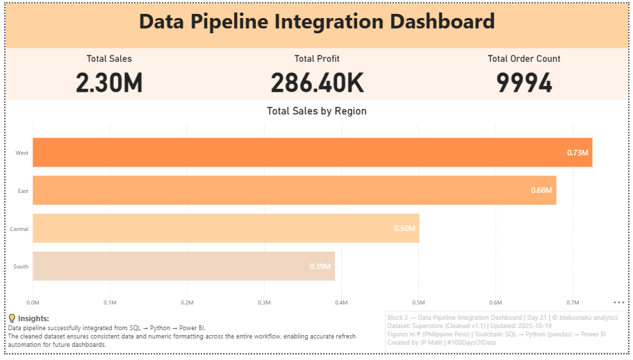

# 🔶 Day 21 — Data Pipeline Integration Dashboard

**Date:** October 19, 2025  
**Phase:** Integration Workflow  
**Tools:** SQL • Python (pandas) • Power BI • GitHub  
**Dataset:** Superstore (Cleaned v1.1)  
**Author:** [JP Malit (blakusnaku)](https://github.com/blakusnaku)

---

## 🧭 Overview
This project demonstrates the **end-to-end integration of a data pipeline**, connecting SQL, Python, and Power BI into a cohesive refreshable workflow.  
It marks the first fully synchronized process where updates in SQL automatically cascade through Python and Power BI — ensuring consistent data hygiene, formatting, and reporting.

---

## ⚙️ Pipeline Flow

| Block | Tool | Focus | Output |
|:------|:-----|:------|:--------|
| **Block 1** | SQL | Create reusable view `superstore_cleaned` | Clean view (`superstore_cleaned`) |
| **Block 2** | Python | Export view results to CSV | `superstore_cleaned.csv` |
| **Block 3** | Power BI | Refresh dataset + apply orange gradient theme | Integrated visual dashboard |
| **Block 4** | GitHub | Document and version the full workflow | `README.md` + `learning_log.md` |

---

## 🧩 Key Learnings
- **SQL Views** streamline data cleaning workflows and act as live tables for downstream tools.  
- Learned to manage errors like `no such table: main.superstore` by confirming table references (`orders` table).  
- **Python** export via `pandas` ensured ISO date preservation with:
`df.to_csv('data/superstore_cleaned.csv', index=False, date_format='%Y-%m-%d')`
- Introduced automatic header normalization:
`df.columns = df.columns.str.strip().str.lower().str.replace(' ', '_')`
- Power BI Locale Fix: used “Change Type → Using Locale → English (Canada)” to enforce YYYY-MM-DD.
- Designed Power BI visuals using the official blakusnaku Orange Palette for cohesive identity:
#FF914D | #FFB072 | #FFD3A1 | #FFE0C2
- Refined South Region color to enhance visual hierarchy and readability.
- Added standardized footer layout with insights and signature.

---

## 📊 Dashboard Preview



Title: Data Pipeline Integration Dashboard
Focus: Regional sales summary across integrated pipeline
Metrics: Total Sales • Total Profit • Total Orders

--- 

## 🧠 Insights (from Block 3)

Data pipeline successfully integrated from SQL → Python → Power BI.
The cleaned dataset ensures consistent date and numeric formatting across the entire workflow, enabling accurate refresh automation for future dashboards.

---

## 🧱 File Structure
```
day21_data_pipeline_integration/
├── assets/
│   └── day21_data_pipeline_integration_dashboard.png
│
├── data/
│   ├── superstore.csv
│   ├── superstore.db
│   └── superstore_cleaned.csv
│
├── scripts/
│   ├── block1_sql_action.sql
│   ├── block2_python_action.py
│   └── superstore_schema.sql
│
├── dashboards/
│   └── block3_data_pipeline_integration.pbix
│
├── notes/
│   └── block4_learning_log.md
│
└── README.md
```

---

## 🏷️ Tags

#100DaysOfData #SQL #Python #Pandas #PowerBI #DataPipeline #AnalyticsJourney #BlakusnakuAnalytics

---