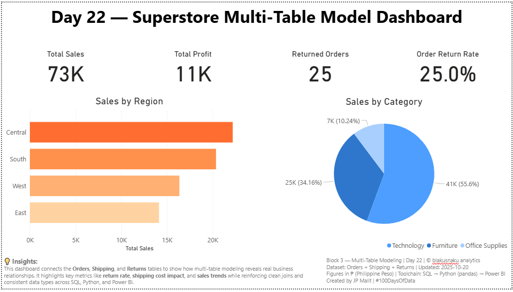

# 📊 Day 22 — Multi-Table Modeling (Orders, Shipping, Returns)
> Integrating SQL joins, Python merges, and Power BI relationships into one connected data model.

---

### 🗓️ **Date:** October 21, 2025  
**Phase:** SQL → Python → Power BI → Documentation  
**Tools:** SQLite, Python (pandas), Power BI  
**Dataset:** Orders + Shipping Cost + Returns (custom-built)  
**Author:** JP Malit (@blakusnaku)

---

## 🧭 Overview
This project demonstrates how multi-table modeling enables richer business insights by combining three custom datasets: **Orders**, **Shipping Cost**, and **Returns**.  
The workflow showcases a complete relational pipeline — from **SQL schema creation**, to **Python merging and validation**, to **Power BI data modeling** — proving how clean relationships turn raw data into interactive, analyzable structures.

---

## 🔗 Pipeline Flow

| Block | Tool | Focus | Output |
|:------|:-----|:------|:-------|
| **Block 1** | SQL | Created schemas and JOINs | `orders`, `shipping_cost`, and `returns` tables |
| **Block 2** | Python | Merged tables, cleaned columns | `merged_orders.csv` for Power BI |
| **Block 3** | Power BI | Modeled relationships, built visuals | Multi-table model dashboard |
| **Block 4** | GitHub | Documentation + reflection | `learning_log.md`, `README.md` |

---

## 🧠 Key Learnings
- Practiced **multi-table JOINs** to mirror real database environments.  
- Reinforced the importance of **consistent keys** and **data types** across sources.  
- Learned how Power BI’s relationship model visually parallels SQL logic.  
- Calculated **Return Rate** with DAX:  
```
Return Rate = [Returned Orders] / COUNTROWS(Orders)
```
- Realized that clean numeric and date formats prevent cross-tool errors during merging.

---

## 💭 Reflections
Day 22 tied together everything learned so far — SQL fundamentals, Python data prep, and Power BI integration — into a single cohesive model. It highlighted how structured joins and clear relationships can transform basic tables into business-ready insights.  
This was a strong step toward mastering relational data pipelines and analytical storytelling through dashboards.

---

## 📈 Dashboard Preview
*(Insert Power BI screenshot or export here)*  


---

## 🧠 Insights
This dashboard connects **Orders**, **Shipping**, and **Returns** tables to reveal real business relationships.  
It highlights **return rates**, **shipping cost impact**, and **sales trends**, reinforcing the value of clean joins and consistent data across the full SQL → Python → Power BI pipeline.

---

## 🧾 Study Dashboard Hub
🔗 [View Main Study Dashboard (Google Sheets)](https://docs.google.com/spreadsheets/d/1TLP4skR9L8p8keZBImYdIXdy1Gyl0mBcUqyHPyfwIXE/edit?usp=sharing)

---

## 🧩 Footer Info
Block 3 — Multi-Table Modeling Dashboard | **Day 22** | © blakusnaku analytics  
Dataset: Orders + Shipping + Returns | Updated: 2025-10-21  
Figures in ₱ (Philippine Peso) | Toolchain: SQL → Python (pandas) → Power BI  
Created by **JP Malit** | #100DaysOfData

---

## 🗂️ File Structure
```
day22_multitable_modeling/
├── assets/
│ └── day22_multitable_dashboard.png
│ 
├── dashboard/
│ └── day22_multitable_model.pbix
│ 
├── data/
│ ├── merged_orders.csv
│ ├── orders.db
│ ├── orders.csv
│ ├── shipping_cost.csv
│ └── returns.csv
│ 
├── scripts/
│ ├── block1_sql_joins_cheatsheet.sql
│ ├── create_orders_table.sql
│ ├── create_returns_table.sql
│ ├── create_shipping_cost_table.sql
│ └── block2_python_action.py
│ 
├── notes/
│ └── block4_learning_log.md
│ 
└── README.md
```

---

## 🔖 Tags
#100DaysOfData #SQL #Python #PowerBI #DataModeling #AnalyticsJourney #BlakusnakuAnalytics
