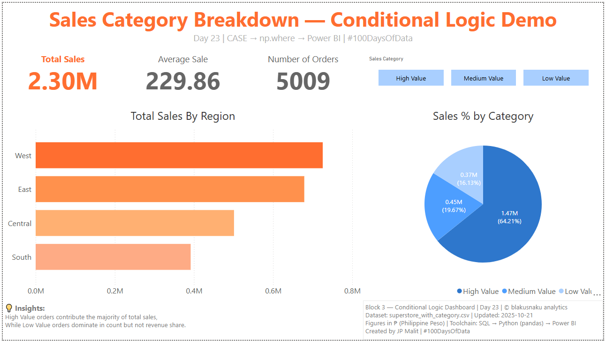

# 📊 Sales Category Breakdown — Conditional Logic Demo  
**Day 23 | CASE → np.where → Power BI | #100DaysOfData**  
**Project Repository:** [blakusnaku-100-days-of-data](https://github.com/blakusnaku-100-days-of-data)  

---

## 🧭 Overview
This project demonstrates how **conditional logic** can be carried consistently across different stages of the analytics pipeline — from SQL querying to Python transformation and Power BI visualization.  
The goal was to classify orders into *High, Medium, or Low* value categories and build a dashboard that responds dynamically to user-selected filters.

---

## 🧩 Pipeline Flow

| Block | Tool | Focus | Output |
|:--:|:--|:--|:--|
| 1 | SQL | `CASE WHEN` classification | Tagged each order by sales range |
| 2 | Python | `np.where()` conditional logic | Created `sales_category` column and exported CSV |
| 3 | Power BI | Category slicer and visuals | “Sales Category Breakdown” dashboard |
| 4 | GitHub | Documentation & reflection | `learning_log.md` and `README.md` |

---

## 📈 Dashboard Preview



**Dashboard Title:** *Sales Category Breakdown — Conditional Logic Demo*  
**Core KPIs:**  
- **Total Sales:** ₱2.30M  
- **Average Sale:** ₱229.86  
- **Number of Orders:** 5,009  

**Visuals:**  
- *Total Sales by Region (Bar Chart)*  
- *Sales % by Category (Pie Chart)*  
- *Dynamic Slicer:* High / Medium / Low  

---

## 🎨 Design Standards
- **Theme Palette:** blakusnaku Orange  
  - `#FF914D`, `#FFB072`, `#FFD3A1`, `#FFF2E9`  
- **Font:** Segoe UI / Poppins  
- **Layout Ratio:** 15% Header | 70% Visuals | 15% Footer  
- **Footer Style:** Divider (`#DADADA`), background (`#F9FAFB`), gray metadata text (`#7A7A7A`)

---

## 💡 Insights
High Value orders contribute the majority of total sales,  
while Low Value orders dominate in count but not in revenue share.  

This consistency of classification across SQL, Python, and Power BI showcases how maintaining logical parity ensures both data accuracy and visual integrity across the analytics stack.

---

## 🧠 Footer Metadata
**Block 3 — Conditional Logic Dashboard | Day 23 | © blakusnaku analytics**  
Dataset: `superstore_with_category.csv` | Updated: 2025-10-21  
Figures in ₱ (Philippine Peso) | Toolchain: SQL → Python (pandas) → Power BI  
Created by **JP Malit** | #100DaysOfData  

---

## ⛓️ Study Dashboard Hub
This project contributes to the ongoing **Study Dashboard Series**, documenting progress across multiple data analytics disciplines.  
View the full learning dashboard here:  
[blakusnaku-study-dashboard GitHub](https://github.com/blakusnaku/blakusnaku-study-dashboard)
 
---

## 📂 File Structure
```
day23_conditional_logic/
├── assets/
│ └── day23_conditional_logic_dashboard.png
│
├── dashboard/
│ └── day23_conditional_logic_dashboard.pbix
│
├── data/
│ ├── superstore.csv
│ ├── superstore.db
│ └── superstore_with_category.csv
│
├── scripts/
│ ├── block1_sql_action.sql
│ ├── superstore_schema.sql
│ └── block2_python_action.py
│
├── notes/
│ └── block4_learning_log.md
│
└── README.md
```

---

## 🔖 Tags
#SQL #Python #PowerBI #DataModeling #ConditionalLogic #AnalyticsJourney #100DaysOfData #BlakusnakuAnalytics
