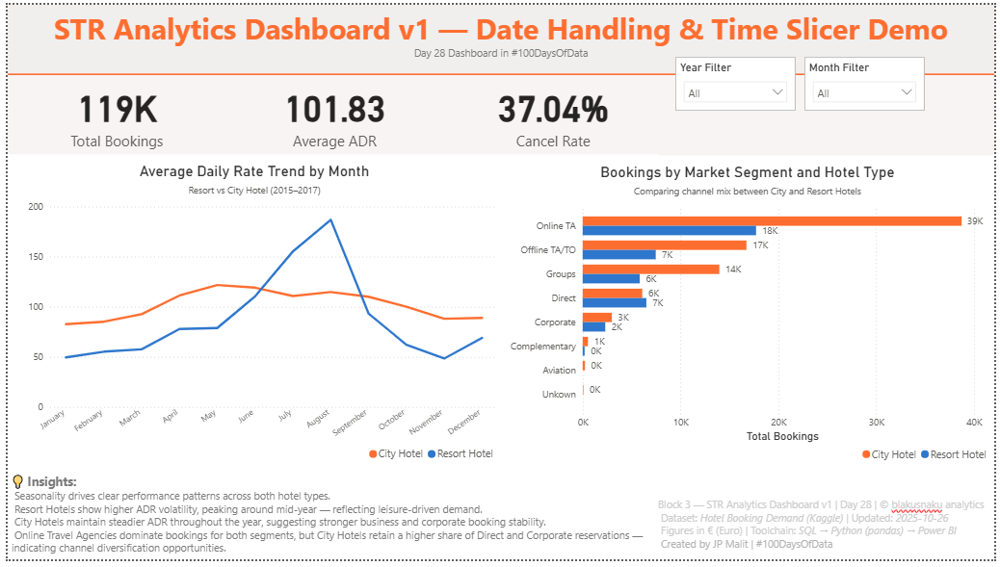

# 🧭 **Day 28 — STR Date Handling & Time Slicer Demo**
**Project:** STR Analytics Foundations  
**Date:** 2025-10-26  
**Author:** JP Malit  
**Repository:** `blakusnaku-100-days-of-data`

---

## 📊 Overview
This project explores **date and time handling** for the STR (Short-Term Rental) analytics pipeline.  
The main goal was to ensure accurate extraction, transformation, and visualization of booking dates across **SQL → Python → Power BI**, forming a consistent foundation for seasonal and time-based insights.

This marks the start of the **STR Analytics Phase**, focusing on hospitality and short-term rental performance metrics.

---

## 🔁 Pipeline Flow

| Block | Tool | Focus | Output |
|:--|:--|:--|:--|
| 1 | SQL | Extract date parts using `YEAR()` / `MONTH()` | Validated query syntax and booking_date logic |
| 2 | Python | Add `.dt.year` and `.dt.month` columns | Cleaned and enriched reservation data |
| 3 | Power BI | Add Year/Month slicers + KPIs | Created **STR Analytics Dashboard v1 — Date Handling & Time Slicer Demo** |
| 4 | GitHub | Document learning outcomes | Learning log and dashboard upload |

---

## 🧠 Key Learnings

- Replaced **"NULL"** text placeholders in `agent` and `company` with `np.nan` before filling missing values.  
- Fixed `"NA"` text entries in `children` column (interpreted as `0`) to resolve Power BI import errors.  
- Flagged and excluded **negative ADR** entries to prevent distorted averages.  
- Practiced **cross-verification of metrics** (row count, ADR, cancel rate) across SQL, Python, and Power BI for pipeline integrity.  
- Designed a **Power BI dashboard** following the blakusnaku signature structure — KPI → Filters → Visuals → Insights.  

---

## 📈 Dashboard Preview

**Title:** STR Analytics Dashboard v1 — Date Handling & Time Slicer Demo  
**File:** `dashboard/str_dashboard_mock.pbix`  
**Preview:**



---

## 💡 Insights

- Seasonality drives ADR volatility, with **Resort Hotels peaking mid-year** due to leisure demand.  
- **City Hotels** show steadier ADR performance, driven by corporate bookings.  
- **Online Travel Agencies** dominate booking volume across both hotel types.  
- **Direct and Corporate channels** remain stronger for City Hotels, suggesting channel mix stability.  

---

## 🧱 Footer

💡 *"Building data you can trust starts with verifying it at every step."*  
_Block 4 — STR Analytics Foundation | Day 28 | © blakusnaku analytics_  
_Created by JP Malit | #100DaysOfData_

---

## ⛓️ Study Dashboard Hub
This project contributes to the ongoing **Study Dashboard Series**, documenting progress across multiple data analytics disciplines.  
View the full learning dashboard here:  
[blakusnaku-study-dashboard GitHub](https://github.com/blakusnaku/blakusnaku-study-dashboard)
 
---

## File Structure
```
day28_str_date_handling/
├── assets/
│   └── str_dashboard_mock_preview.png
│ 
├── dashboard/
│   └── str_dashboard_mock.pbix
│ 
├── data/
│   ├── str_analytics.db
│   ├── str_reservations_clean.csv
│   └── hotel_bookings.csv
│ 
├── notes/
│   └── block4_learning_log.md
│ 
├── scripts/
│   ├── block1_sql_action.sql
│   ├── str_reservations_schema.sql
│   └── block2_python_action.py
│ 
└── README.md
```

## 🔖 Tags
#SQL #Python #PowerBI #DataModeling #AnalyticsJourney #100DaysOfData #BlakusnakuAnalytics
