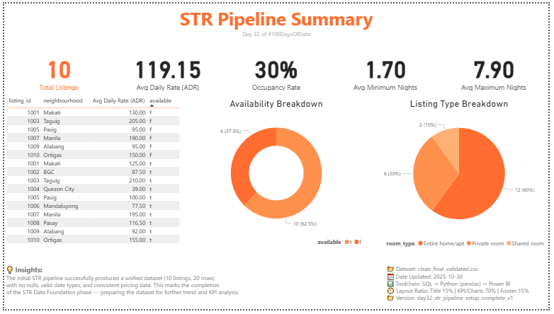

# 📊 Day 32 — STR Pipeline Setup Complete  
**Date:** 2025-10-30  
**Project:** Short-Term Rental (STR) Analytics  
**Phase:** Data Foundation  
**Tools:** SQL • Python (pandas) • Power BI  
**Dataset:** `clean_final_validated.csv`  
**Author:** JP Malit  

---

## 🧩 Overview  
This session finalized the **foundation of the STR analytics pipeline**, integrating and validating the dataset end-to-end across SQL, Python, and Power BI.  
The main objective was to produce a **clean, reliable dataset** and validate its structure through KPIs and visual summaries — marking the official completion of the STR Data Foundation phase.

---

## 🔁 Pipeline Flow  

| Block | Tool | Focus | Output |
|--------|------|--------|---------|
| 1 | SQL | Create final cleaned STR dataset (merged listings + calendar) | `clean_final` table |
| 2 | Python | Validate dataset shape and nulls | `clean_final_validated.csv` |
| 3 | Power BI | Build summary page of STR metrics | STR Pipeline Summary Dashboard |
| 4 | GitHub | Reflection summary | `block4_learning_log.md` |

---

## 📘 Key Learnings  
- Importance of **consistent schema and column naming** for smooth joins.  
- Normalizing categorical data early avoids issues in BI visuals (e.g., `" t"` vs `"t"`).  
- Establishing a **structured data directory** (`raw`, `interim`, `processed`) improves clarity and version control.  
- Converting `date` columns to proper datetime types enables clean time-series visuals in Power BI.  
- Implementing a **consistent color and layout standard** ensures design coherence across dashboards.

---

## 📊 Dashboard Preview  

### **STR Pipeline Summary**


**Highlights:**
- **10 Total Listings**  
- **119.15 Avg Daily Rate (ADR)**  
- **30% Occupancy Rate**  
- **1.70 Avg Minimum Nights**  
- **7.90 Avg Maximum Nights**  
- Availability Breakdown (`t` vs `f`)  
- Listing Type Breakdown (`Entire home/apt`, `Private room`, `Shared room`)  

---

## 🧠 Insights (Footer)
> The initial STR pipeline successfully produced a unified dataset (10 listings, 20 rows) with no nulls, valid date types, and consistent pricing data.  
> This marks the completion of the STR Data Foundation phase — preparing the dataset for further trend and KPI analysis.

---

## 🧭 Study Dashboard Hub  
This project contributes to the ongoing **Study Dashboard Series**, documenting progress across multiple data analytics disciplines.  
View the full learning dashboard here:  
🔗 [**blakusnaku Study Dashboard**](https://github.com/blakusnaku/blakusnaku-100-days-of-data)

---

## 📂 File Structure  

```
day32_str_pipeline_setup_complete/
├── assets/
│   └── str_pipeline_summary_v1.png
├── dashboard/
│   └── str_pipeline_summary_v1.pbix
├── data/
│   ├── raw/
│   │   ├── listings.csv
│   │   └── calendar.csv 
│   └── processed/
│       ├── clean_final.csv
│       └── clean_final_validated.csv
├── scripts/
│   ├── block1_sql_action.sql
│   └── block2_python_action.py 
├── notes/
│   └── block4_learning_log.md
└── README.md
```

## 🏷️ Tags

#100DaysOfData #SQL #Python #Pandas #PowerBI #DataPipeline #ETL #DataCleaning #DashboardDesign #AnalyticsJourney #BlakusnakuAnalytics